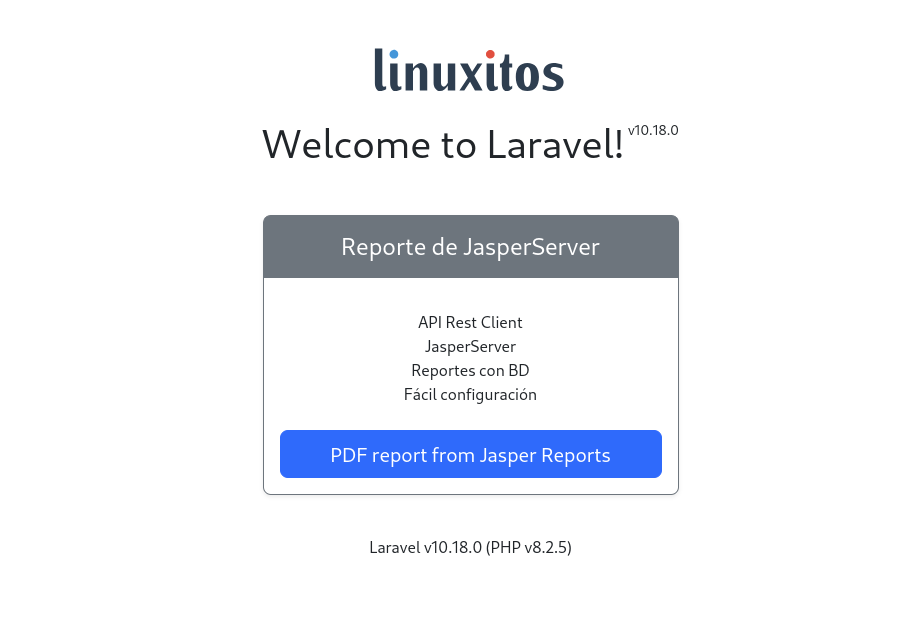
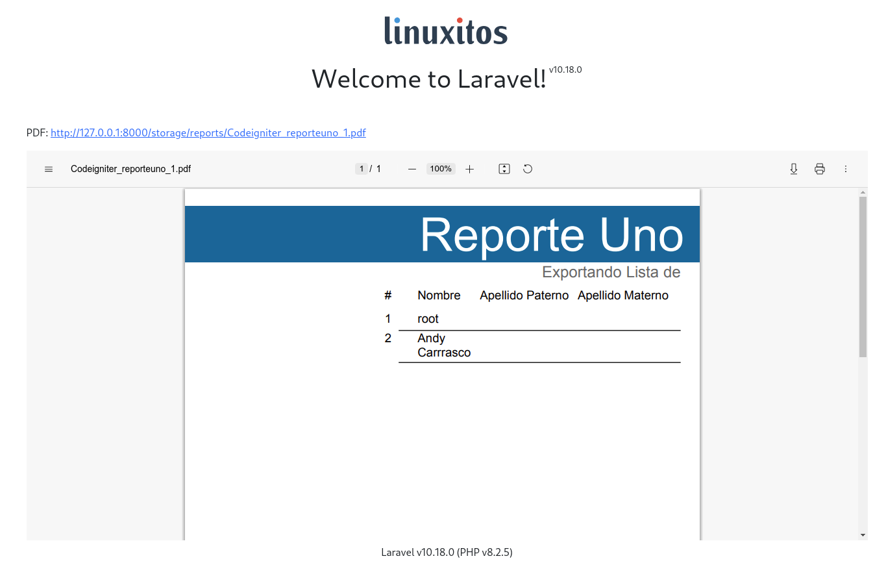

# Laravel 10 con Jaspersoft Rest Client



## Qué es Laravel?

Laravel es un framework de código abierto para desarrollar aplicaciones y servicios web con PHP 5 y PHP 7. Su filosofía es desarrollar código PHP de forma elegante y simple, evitando el "código espagueti". [official site](https://laravel.com/).

## Qué es Jaspersoft Rest Client?

Es una librería que se utilizar para realizar peticiones e interactuar con los reportes alojados en Jasper Reports Server a través de la API REST en PHP nativo. Esto permite incrustar más fácilmente los datos en el servidor de reportes, o realizar tareas administrativas en el servidor utilizando PHP.

## Requerimientos para éste ejemplo

- SO Fedora 38 (Puede usarse otro SO, sin embargo se utilizó una distro GNU/Linux)
- XAMPP 8.2.4
- PHP 8.2.4
- Laravel 10
- Jaspersoft Rest Client 2.0
- Composer

## Installación de Jaspersoft Rest Client en Laravel 10

### Configuración de Jasper Server
** Importante! Se asume que se cuenta con Jasper Server configurado y con al menos un reporte, ya sea con conexión a base de datos o no.

### Crear proyecto Laravel 10

Crear un nuevo proyecto con composer

```
 composer create-project --prefer-dist laravel/laravel laravelcv10-jasper
```

**Si sólo se clona el repositorio, no olvidar ejecutar el comando composer update, para actualizar y descargar los paquetes:

```
 composer update
```

### Configurar el archivo .env

En el archivo .env se configuran los accesos para jasperreports añadir lo siguiente y adaptarlo al proyecto que se use

```
JASPER_SERVER_USERNAME=jasperadmin
JASPER_SERVER_PASSWORD=jasperadmin
JASPER_SERVER_URL=http://localhost:8080/jasperserver
```


### Añadir el paquete de jaspersoft/rest-client

Entrar al proyecto desde la terminal y descargar el paquete:


```
composer require jaspersoft/rest-client
```


### Configurar autoload

Añadir que se cargue el archivo Helpers/jasper.php

```
[...]

"autoload": {
    "psr-4": {
        "App\\": "app/",
        "Database\\Factories\\": "database/factories/",
        "Database\\Seeders\\": "database/seeders/"
    },
    "files": [
        "app/Helpers/jasper.php"
    ]
},

[...]
```

### Añadir archivo helper llamado jasper

Crear en dentro del directorio App/Helpers  el archivo jasper.php y añadir lo siguiente
** Aquí se configura la jasper server, por lo que si las contraseñas o dirección url, no corresponden a las predeterminadas, realizar el cambio

```
<?php
use Illuminate\Support\Facades\Storage;
use Jaspersoft\Client\Client;

function reporte($idRegistro, $name, $params, $type = 'pdf')
{
    try {
        $client = new Client(env('JASPER_SERVER_URL'), env('JASPER_SERVER_USERNAME'), env('JASPER_SERVER_PASSWORD'));
        $report = $client->reportService()->runReport('/reports/'.$name, $type, null, null, $params);
        $nombre_temporal = str_replace('/', '_', $name).'_'.$idRegistro.'.'.$type;
        Storage::disk('public')->put('reports/'.$nombre_temporal, $report);

        return 'storage/reports/'.$nombre_temporal;
    } catch (Throwable $error) {
        return 'error '.$error;
    }
}

```

### Añadir al archivo web.php

```
Route::get('/', function () {
    return view('welcome');
})->name('/');

Route::get('reports', 'App\Http\Controllers\ReportController@index')->name('reports');
```

### Crear el controlador ReportController.php

```
php artisan make:controller ReportController --resource
```

Y añadir en el método index

```
public function index()
{
    $params = [
        'nombre_movimiento' => 'Determinación del trámite',
        'autoriza' => '',
        'cargo' => '',
    ];
    $pdf = reporte(1, 'Codeigniter/reporteuno', $params, 'pdf');
    return view('report', compact('pdf'));
}
```

### Crear la vista report.blade.php


```
<!DOCTYPE html>
<html lang="{{ str_replace('_', '-', app()->getLocale()) }}">
    <head>
        <meta charset="utf-8">
        <title>Test Report Jasper Laravel 10 | linuxitos</title>
        <link rel="icon" href="{{ asset('assets/images/favicon.png')}}" type="image/png">
	    <link href="https://cdn.jsdelivr.net/npm/bootstrap@5.3.1/dist/css/bootstrap.min.css" rel="stylesheet" integrity="sha384-4bw+/aepP/YC94hEpVNVgiZdgIC5+VKNBQNGCHeKRQN+PtmoHDEXuppvnDJzQIu9" crossorigin="anonymous">
        <link rel="preconnect" href="https://fonts.bunny.net">
        <link href="https://fonts.bunny.net/css?family=figtree:400,600&display=swap" rel="stylesheet" />
    </head>
    <body class="antialiased">
        <div class="container">
            <main>
                <div class="py-5 text-center">
                    <a href="{{route('/')}}">
                        
                    </a>
                    <h1 class="d-inline">Welcome to Laravel!</h1> <small class="small align-top">v{{ Illuminate\Foundation\Application::VERSION }}</small>
                </div>
                <div class="row">
                    <div class="col-md-12">
                        <p>
                            PDF: <a href="{{asset($pdf)}}" target="_blank">{{asset($pdf)}}</a>
                        </p>
                    </div>
                </div>
                <div class="row">
                    <div class="col-md-12">
                        <embed src="{{asset($pdf)}}" type="application/pdf" width="100%" height="600px"/>
                    </div>
                </div>
                <div class="ml-4 text-center text-sm text-gray-500 dark:text-gray-400 sm:text-right sm:ml-0">
                    Laravel v{{ Illuminate\Foundation\Application::VERSION }} (PHP v{{ PHP_VERSION }})
                </div>
            </main>
        </div>
        <script src="https://cdn.jsdelivr.net/npm/bootstrap@5.3.1/dist/js/bootstrap.bundle.min.js" integrity="sha384-HwwvtgBNo3bZJJLYd8oVXjrBZt8cqVSpeBNS5n7C8IVInixGAoxmnlMuBnhbgrkm" crossorigin="anonymous"></script>
    </body>
</html>
```

### Crear enlace con link

Verificar que el directorio storage/app/public/reports exista, en caso de que no, crearlo manualmente.

```
php artisan storage:link
```


### Iniciar el proyecto

```
php artisan serve
```

Abrir el enclace http://127.0.0.1:8000/reports



## Licencia

Y por supuesto:

[](https://opensource.org/licenses/MIT)